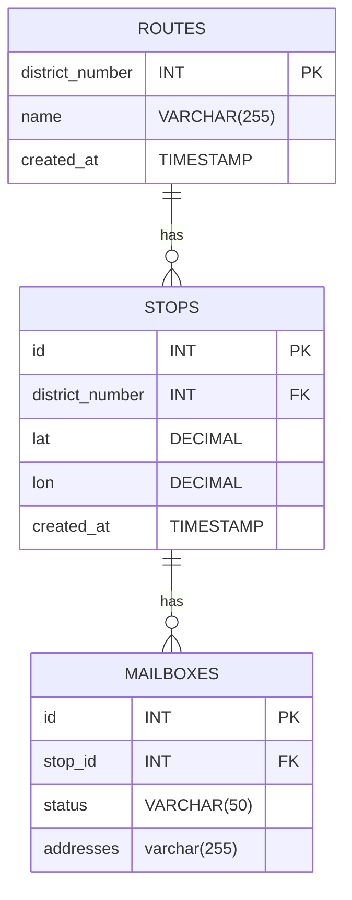

```mermaid
erDiagram
ROUTES ||--o{ STOPS : has
STOPS ||--o{ MAILBOXES : has


    ROUTES  {
        district_number INT PK
        name VARCHAR(255)
        created_at TIMESTAMP
    }

    STOPS {
        id INT PK
        district_number INT FK
        lat DECIMAL
        lon DECIMAL
        created_at TIMESTAMP
    }

    MAILBOXES {
    id INT PK
    stop_id INT FK
    status VARCHAR(50)
    addresses varchar(255)
    }
```
