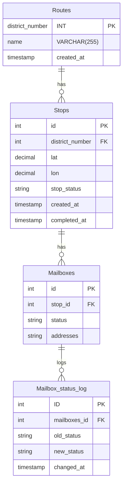

```mermaid
erDiagram
Routes ||--o{ Stops : has
Stops ||--o{ Mailboxes : has
Mailboxes ||--o{ Mailbox_status_log : logs


    Routes  {
        district_number INT PK
        name VARCHAR(255)
        timestamp created_at
    }

    Stops {
        int id PK
        int district_number FK
        decimal lat
        decimal lon
        string stop_status
        timestamp created_at
        timestamp completed_at 
    }

    Mailboxes {
        int id PK
        int stop_id FK
        string status 
        string addresses 
    }

    Mailbox_status_log {
        int ID PK
        int mailboxes_id FK
        string old_status
        string new_status
        timestamp changed_at
    }
```
